# Finn Chatbot 🤖💰

> **The Next-Gen Financial Assistant.**  
> *Orchestrated with LangGraph, Powered by Self-Reflective AI, Built for Smart Finance.*

Finn Chatbot is an enterprise-grade financial assistant that moves beyond simple Q&A. It uses a **multi-agent architecture** to deterministically analyze financial data, perform intelligent vector searches, and execute complex workflows securely.

Unlike standard chatbots, Finn understands the difference between a *calculation* (which needs SQL) and a *lookup* (which needs Semantic Search), ensuring 100% accuracy on numbers while maintaining natural conversation.

---

## 🧠 The "Brain": Agentic Architecture

Finn is heavily engineered using **LangGraph**, utilizing a state-machine based multi-agent architecture. This ensures deterministic control flow even when agents act autonomously.

### 🌟 Top-Level Orchestration Flow

The Orchestrator acts as the Semantic Router, analyzing user intent and delegating work to specialized agents.

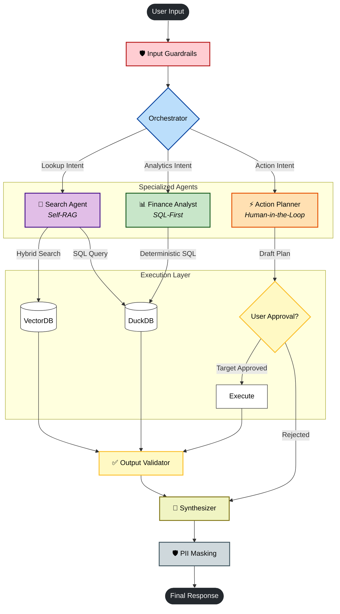

### 🤖 Agent Patterns Used

Finn employs specific **Agentic Design Patterns** tailored to each domain constraint:

| Agent | Design Pattern | Why? |
|-------|----------------|------|
| **Finance Analyst** | **Tool Calling** (One-Shot) | Financial math must be exact. An LLM calculates nothing; it only provides parameters to deterministic SQL tools. |
| **Search Agent** | **Self-RAG** (ReAct Loop) | Search is messy. The agent performs a *Reason -> Act -> Observe* loop, grading its own results and rewriting queries if they fail. |
| **Action Planner** | **Human-in-the-Loop** | High-stakes actions (e.g., "Delete Category") require a pause in execution for explicit user confirmation. |

---

## 🔎 Deep Dive: Self-Reflective Search (ReAct)

The Search Agent implements the **Self-RAG** pattern (a specialized ReAct loop). It mimics a human researcher:

1.  **A**ct: Perform initial search.
2.  **O**bserve: Read results.
3.  **R**eflect: "Are these results relevant? Do they answer the specific question?"
4.  **R**eason: "If not, why? Maybe I should remove the date filter."
5.  **A**ct: Execute refined search.

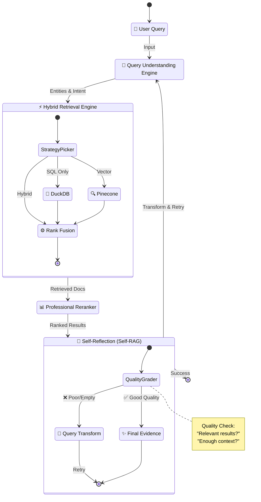

1.  **Retrieve**: Hybrid search (BM25 + Embeddings).
2.  **Grade**: An LLM (The "Critic") evaluates the results. "Did I find what the user asked for?"
3.  **Transform**: If the grade is poor, another LLM (The "Improver") analyzes *why* it failed and generates a better query.
4.  **Loop**: This cycle repeats until good results are found or max attempts are reached.

---

## 📊 Deep Dive: SQL-First Analytics

Finn ensures **100% accuracy** for numbers by never letting the LLM do math. Instead, it uses a deterministic "SQL-First" pipeline.

```mermaid
sequenceDiagram
    participant User
    participant LLM as 🧠 Finance Analyst
    participant Builder as 🛠️ SQL Builder
    participant DB as 💾 DuckDB

    User->>LLM: "How much did I spend on food last month?"
    
    rect rgb(20, 20, 20)
        Note over LLM: Intent Understanding
        LLM->>LLM: Extract Filters: {category: "food", date: "last_month"}
        LLM->>LLM: Select Metric: SUM_AMOUNT
    end
    
    LLM->>Builder: MetricRequest(metric="SUM", filters={...})
    
    rect rgb(230, 240, 255)
        Note over Builder: Deterministic Code
        Builder->>Builder: Select SQL Template
        Builder->>Builder: Inject Safe Parameters
    end
    
    Builder->>DB: "SELECT sum(amount) FROM transactions WHERE..."
    DB-->>Builder: Result: 1,450.50
    Builder-->>User: "You spent 1,450.50 TRY last month."
```

### 🗄️ Simplified Data Model

The core transaction model used for analytics and search:

| Field | Type | Description |
|-------|------|-------------|
| `date_time` | TIMESTAMP | Full timestamp of transaction |
| `amount` | DECIMAL | Transaction amount (negative for expense) |
| `merchant_norm` | TEXT | Normalized merchant name (e.g., "Apple" vs "APPLE.COM") |
| `description` | TEXT | Raw transaction description |
| `category` | TEXT | High-level category (e.g., "Food & Dining") |
| `subcategory` | TEXT | Specific sub-category (e.g., "Restaurants") |
| `direction` | ENUM | `income`, `expense`, or `transfer` |

---

## 🛠️ Tech Stack

### Backend Powerhouse
*   **Orchestration**: `LangGraph`, `LangChain`
*   **LLMs**: Anthropic Claude 3.5 Sonnet / OpenAI GPT-4o
*   **Database**: `DuckDB` (Fast OLAP SQL), `Pinecone` (Vector Search)
*   **API**: `FastAPI` (Python 3.10+)

### Modern Frontend
*   **Framework**: `Next.js 14` (App Router)
*   **Styling**: `Tailwind CSS`, `Shadcn UI`
*   **State**: `Zeustand`, `TanStack Query`

---

## 📸 Screenshots

<div align="center">

### 💬 Chat Interface & Conversations

<table>
  <tr>
    <td>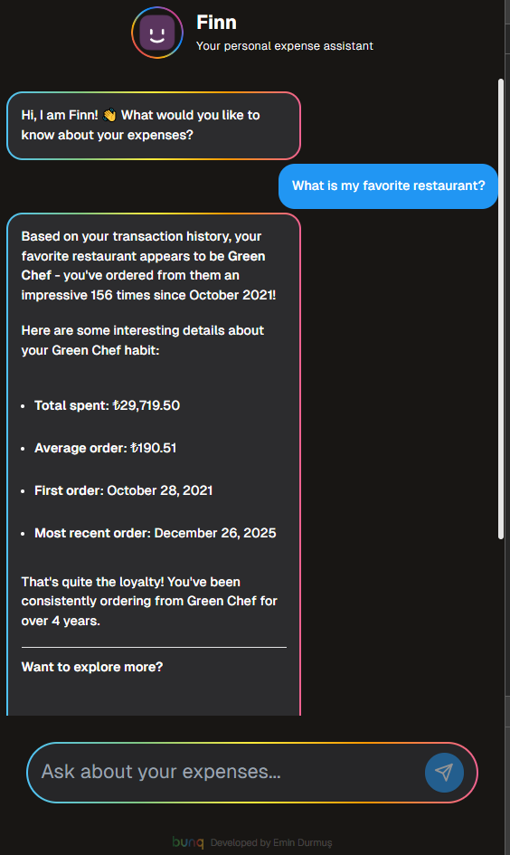</td>
    <td>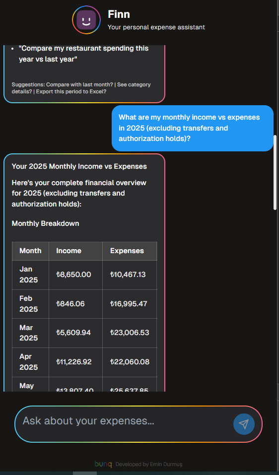</td>
  </tr>
  <tr>
    <td align="center"><em>Modern Chat Interface</em></td>
    <td align="center"><em>Natural Conversation Flow</em></td>
  </tr>
</table>

### 📊 Financial Analytics

<table>
  <tr>
    <td>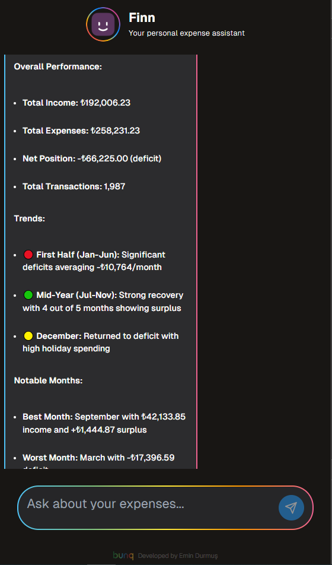</td>
    <td>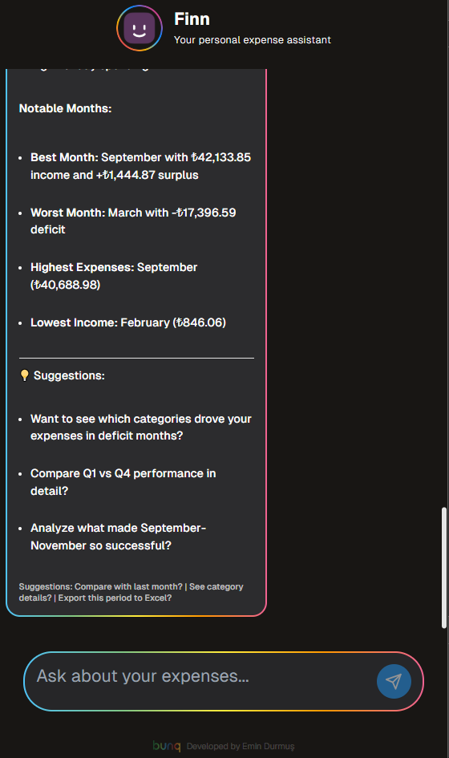</td>
  </tr>
  <tr>
    <td align="center"><em>Financial Analytics Dashboard</em></td>
    <td align="center"><em>Spending Insights</em></td>
  </tr>
</table>

### 🔍 Search & Discovery

<table>
  <tr>
    <td>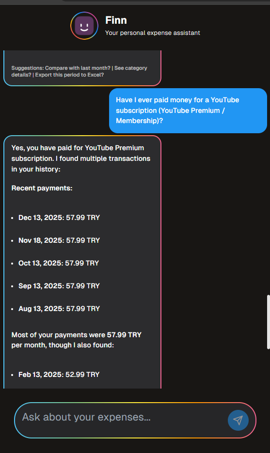</td>
    <td>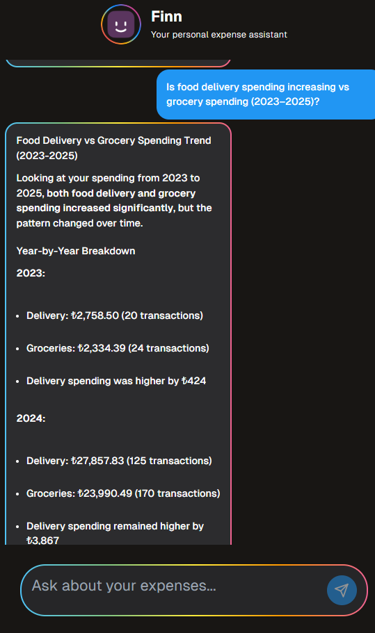</td>
  </tr>
  <tr>
    <td align="center"><em>Intelligent Search</em></td>
    <td align="center"><em>Transaction Details</em></td>
  </tr>
</table>

### ⚡ Advanced Features

<table>
  <tr>
    <td>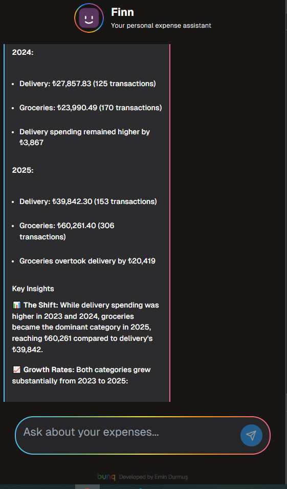</td>
    <td>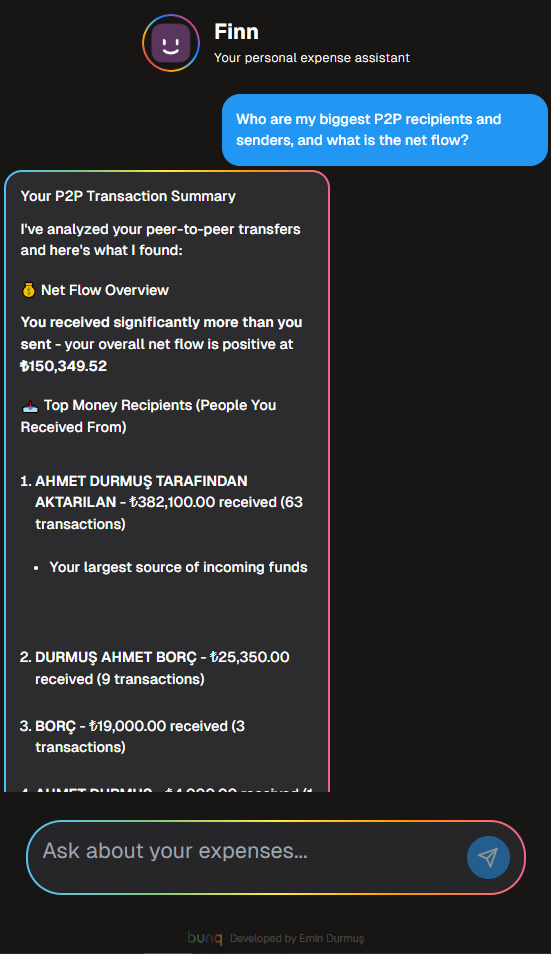</td>
  </tr>
  <tr>
    <td align="center"><em>Advanced Capabilities</em></td>
    <td align="center"><em>Rich Feature Set</em></td>
  </tr>
</table>

</div>

---

## 🚀 Getting Started

### Prerequisites
*   Python 3.10+
*   Node.js 18+
*   API Keys: Anthropic, Pinecone

### 1. Backend Setup

```bash
# Clone the repo
git clone https://github.com/EminDurmuSS/finn-chatbot.git
cd finn-chatbot

# Create virtual environment
python -m venv .venv
# Activate:
# Windows: .venv\Scripts\activate
# Mac/Linux: source .venv/bin/activate

# Install dependencies (Editable mode)
pip install -e "."

# Configure Environment
cp .env.example .env
# ⚠️ Edit .env with your ANTHROPIC_API_KEY and PINECONE_API_KEY
```

### 2. Frontend Setup

```bash
cd frontend

# Install dependencies
npm install

# Run development server
npm run dev
```

Visit `http://localhost:3000` to start chatting with Finn! 💬

---

## 📂 Project Structure

```
finn-chatbot/
├── statement_copilot/      # 🧠 The Brain (Python Package)
│   ├── agents/             # Specialist Agents
│   │   ├── finance_analyst.py  # SQL Logic
│   │   ├── search_graph.py     # Self-RAG Logic
│   │   └── orchestrator.py     # Routing Logic
│   ├── core/               # Core Utilities (DB, LLM)
│   ├── api/                # FastAPI Endpoints
│   └── workflow.py         # Main Graph Definition
├── frontend/               # 🎨 User Interface (Next.js)
├── tests/                  # ✅ Comprehensive Test Suite
└── scripts/                # 🔧 Maintenance Scripts
```

---

## 🤝 Contributing

Contributions are welcome! Please feel free to submit a Pull Request.

## 📄 License

This project is licensed under the MIT License.