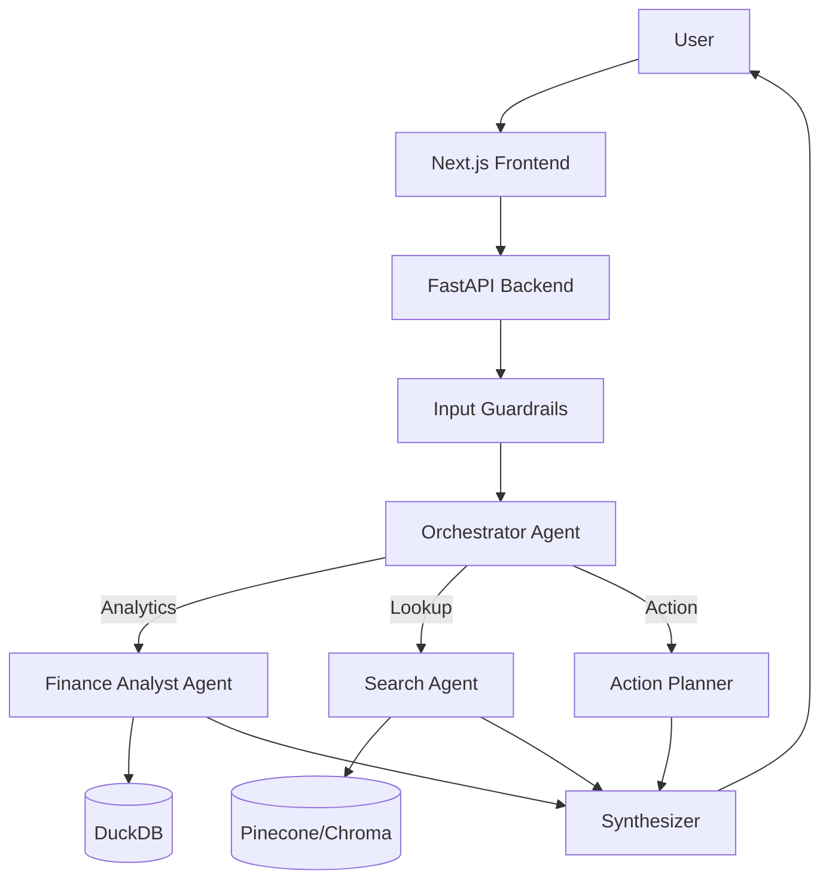

# Finn Chatbot 🤖💰

> **AI-Powered Financial Assistant**  
> *Orchestrated with LangGraph, Powered by LLMs, Built for Smart Finance.*

 Finn Chatbot is a sophisticated financial assistant designed to help users analyze their spending, find specific transactions, and manage their finances through a natural language interface. It combines **SQL-based analytics**, **vector search (RAG)**, and **multi-agent orchestration** to deliver accurate and context-aware responses.

---

## 🌟 Key Features

*   **🧠 Multi-Agent Architecture**: Uses `LangGraph` to orchestrate specialized agents:
    *   **Orchestrator**: Routes user intents (Analytics, Search, specific actions).
    *   **Finance Analyst**: Generates executable SQL for precise financial calculations (trends, totals, categorization).
    *   **Search Agent**: Performs hybrid RAG (Vector + Keyword) to find transaction details.
    *   **Action Planner**: Handles complex workflows like reporting or alerts.
*   **🔎 Hybrid Search Engine**: Combines **BM25** (keyword) and **Dense Embeddings** (semantic) using `Pinecone` and `ChromaDB` for optimal retrieval.
*   **📊 SQL-First Truth**: Relies on deterministic SQL queries (via `DuckDB`) for hard numbers, avoiding LLM hallucinations on math.
*   **🛡️ Enterprise-Grade Guardrails**:
    *   Input/Output validation.
    *   PII Masking.
    *   Human-in-the-loop confirmation for sensitive actions.
*   **💻 Modern Frontend**: Sleek, responsive chat interface built with **Next.js 14** and **Tailwind CSS**.

---

## 🏗️ Architecture



---

## 🛠️ Tech Stack

### Backend
*   **Framework**: Python 3.10+, FastAPI
*   **AI Orchestration**: LangChain, LangGraph
*   **LLMs**: Anthropic Claude 3.5 Sonnet / OpenAI GPT-4o
*   **Database**: DuckDB (Analytics), Pinecone (Vector Store)
*   **Tools**: Pydantic, Pandas, NumPy

### Frontend
*   **Framework**: Next.js 14 (App Router)
*   **Styling**: Tailwind CSS, Lucide Icons
*   **State**: React Hooks

---

## 🚀 Getting Started

### Prerequisites
*   Python 3.10+
*   Node.js 18+
*   Anthropic/OpenAI API Keys
*   Pinecone API Key

### 1. Backend Setup

```bash
# Clone the repo
git clone https://github.com/EminDurmuSS/finn-chatbot.git
cd finn-chatbot

# Create virtual environment
python -m venv .venv
source .venv/bin/activate  # Windows: .venv\Scripts\activate

# Install dependencies
pip install -e "."

# Configure Environment
cp .env.example .env
# Edit .env with your API Keys (ANTHROPIC_API_KEY, PINECONE_API_KEY, etc.)
```

### 2. Frontend Setup

```bash
cd frontend

# Install dependencies
npm install

# Run development server
npm run dev
```

The frontend will be available at `http://localhost:3000`.

---

## 📂 Project Structure

```
finn-chatbot/
├── statement_copilot/      # 🧠 Backend Core (Python)
│   ├── agents/             # Specialized AI Agents
│   ├── core/               # LLM, DB, and Search Logic
│   ├── api/                # FastAPI Endpoints
│   └── workflow.py         # LangGraph Graph Definition
├── frontend/               # 🎨 Frontend Application (Next.js)
├── data/                   # 📁 Data Ingestion & Taxonomy
├── db/                     # 💾 Database Files (Ignored in git)
├── scripts/                # 🔧 Utility Scripts
└── tests/                  # ✅ Unit & Integration Tests
```

---

## 🤝 Contributing

Contributions are welcome! Please feel free to submit a Pull Request.

## 📄 License

This project is licensed under the MIT License.
