# Finn Chatbot 🤖💰

> **The Next-Gen Financial Assistant.**  
> *Orchestrated with LangGraph, Powered by Self-Reflective AI, Built for Smart Finance.*

Finn Chatbot is an enterprise-grade financial assistant that moves beyond simple Q&A. It uses a **multi-agent architecture** to deterministically analyze financial data, perform intelligent vector searches, and execute complex workflows securely.

Unlike standard chatbots, Finn understands the difference between a *calculation* (which needs SQL) and a *lookup* (which needs Semantic Search), ensuring 100% accuracy on numbers while maintaining natural conversation.

---

## 🧠 The "Brain": Agentic Architecture

Finn is built on `LangGraph`, utilizing a state machine to orchestrate specialized agents. Each agent has a single responsibility and a strict contract.

### 🌟 Top-Level Orchestration Flow

The Orchestrator acts as the "Manager", deciding which specialist needs to handle the user's request.


### 🤖 Meet The Agents

#### 1. 📊 Finance Analyst (The "Quants")
*   **Role**: Handles questions about totals, trends, averages, and comparisons.
*   **Superpower**: **SQL-First Truth**. It doesn't "guess" numbers. It writes accurate SQL queries to calculate exact figures from the database.
*   **Example**: *"How much did I spend on groceries last month compared to January?"*

#### 2. 🔎 Search Agent (The "Detective")
*   **Role**: Finds specific transactions or details buried in descriptions.
*   **Superpower**: **Self-Reflective RAG**. It doesn't just search once; it evaluates its own search results. If the results are poor, it rewrites its own query and tries again—automatically.
*   **Example**: *"Find that payment I made to a burger place in Istanbul."*

#### 3. ⚡ Action Planner (The "Doer")
*   **Role**: Executes state-changing actions like creating reports, setting alerts, or exporting data.
*   **Superpower**: **Human-in-the-Loop**. Critical actions pause execution and require explicit user approval before proceeding.
*   **Example**: *"Create a PDF report of my travel expenses."*

---

## 🔎 Deep Dive: Self-Reflective Search

The Search Agent is a valid subgraph that implements the **Self-RAG** pattern. It mimics how a human searches: *Search -> Read -> "This isn't what I wanted" -> Refine Search -> Try Again*.

```mermaid
stateDiagram-v2
    [*] --> Retrieve
    
    state "🔍 Retrieve" as Retrieve
    state "🧐 Grade Results" as Grade
    state "🔄 Transform Query" as Transform
    
    Retrieve --> Grade: Fetch Docs
    
    state if_grade <<choice>>
    Grade --> if_grade: Evaluate Quality
    
    if_grade --> [*]: Good Results ✅
    if_grade --> Transform: Poor Results ❌
    
    Transform --> Retrieve: Retry with Better Query
    
    note right of Grade
        LLM checks:
        1. Relevance
        2. Completeness
        3. Typo Handling
    end note
```



1.  **Retrieve**: Hybrid search (BM25 + Embeddings).
2.  **Grade**: An LLM (The "Critic") evaluates the results. "Did I find what the user asked for?"
3.  **Transform**: If the grade is poor, another LLM (The "Improver") analyzes *why* it failed and generates a better query.
4.  **Loop**: This cycle repeats until good results are found or max attempts are reached.

---

## 🛠️ Tech Stack

### Backend Powerhouse
*   **Orchestration**: `LangGraph`, `LangChain`
*   **LLMs**: Anthropic Claude 3.5 Sonnet / OpenAI GPT-4o
*   **Database**: `DuckDB` (Fast OLAP SQL), `Pinecone` (Vector Search)
*   **API**: `FastAPI` (Python 3.10+)

### Modern Frontend
*   **Framework**: `Next.js 14` (App Router)
*   **Styling**: `Tailwind CSS`, `Shadcn UI`
*   **State**: `Zeustand`, `TanStack Query`

---

## 🚀 Getting Started

### Prerequisites
*   Python 3.10+
*   Node.js 18+
*   API Keys: Anthropic, Pinecone

### 1. Backend Setup

```bash
# Clone the repo
git clone https://github.com/EminDurmuSS/finn-chatbot.git
cd finn-chatbot

# Create virtual environment
python -m venv .venv
# Activate:
# Windows: .venv\Scripts\activate
# Mac/Linux: source .venv/bin/activate

# Install dependencies (Editable mode)
pip install -e "."

# Configure Environment
cp .env.example .env
# ⚠️ Edit .env with your ANTHROPIC_API_KEY and PINECONE_API_KEY
```

### 2. Frontend Setup

```bash
cd frontend

# Install dependencies
npm install

# Run development server
npm run dev
```

Visit `http://localhost:3000` to start chatting with Finn! 💬

---

## 📂 Project Structure

```
finn-chatbot/
├── statement_copilot/      # 🧠 The Brain (Python Package)
│   ├── agents/             # Specialist Agents
│   │   ├── finance_analyst.py  # SQL Logic
│   │   ├── search_graph.py     # Self-RAG Logic
│   │   └── orchestrator.py     # Routing Logic
│   ├── core/               # Core Utilities (DB, LLM)
│   ├── api/                # FastAPI Endpoints
│   └── workflow.py         # Main Graph Definition
├── frontend/               # 🎨 User Interface (Next.js)
├── tests/                  # ✅ Comprehensive Test Suite
└── scripts/                # 🔧 Maintenance Scripts
```

---

## 🤝 Contributing

Contributions are welcome! Please feel free to submit a Pull Request.

## 📄 License

This project is licensed under the MIT License.
